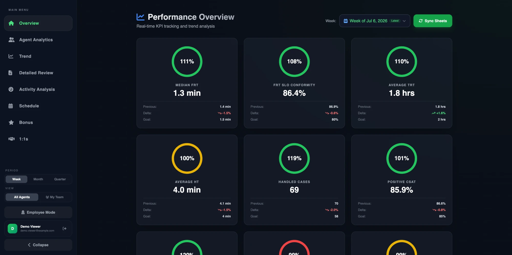
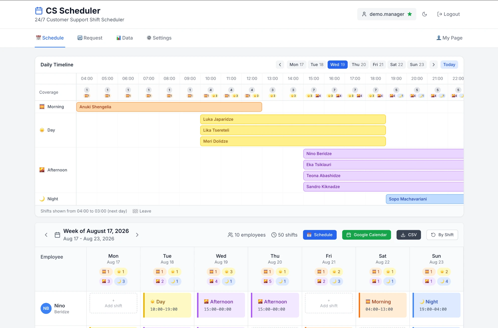
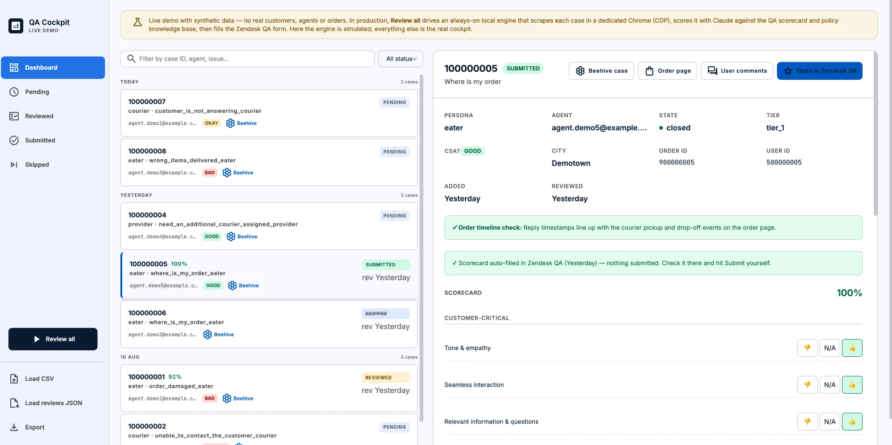
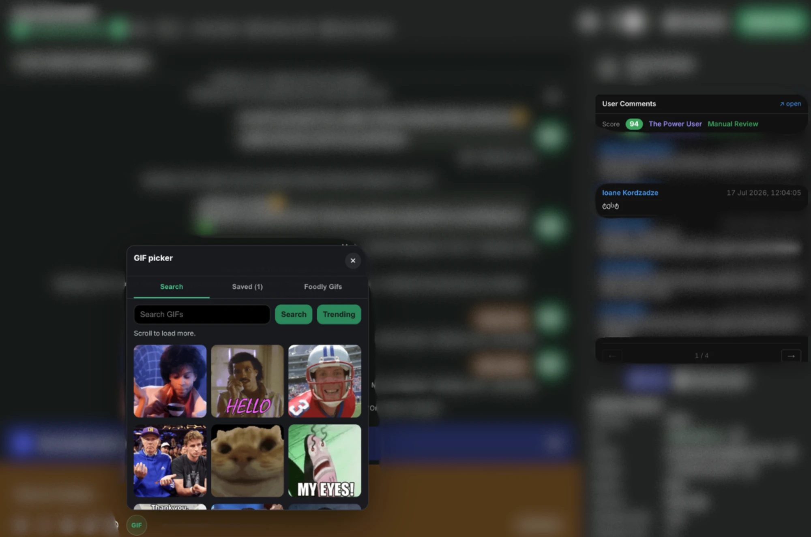

# portfolio-site

Source of [io-portfolio-demo.web.app](https://io-portfolio-demo.web.app) — my portfolio page. One static HTML file, hand-written CSS, no framework, no build step. Deployed on Firebase Hosting.

I'm a customer support operations manager at Bolt Food who builds the software his team runs on. The site presents those tools; each has a sanitized public repo and, where a backend isn't required, a live demo.

## What's on the site

### CS Performance Dashboard
KPI and review platform used by 30 managers across 180 agents. Per-agent trends, team rankings, a weighted bonus calculator, AI-drafted performance reviews, Slack delivery.
[Live demo](https://io-kpi-dashboard-demo.web.app) · [source](https://github.com/Plazmashock/cs-kpi-dashboard)



### CS Shift Scheduler
24/7 roster generator built on Google OR-Tools CP-SAT: rest rules, coverage minimums, leave imports, swap approvals, Slack and Google Calendar integrations. All names in the screenshot are demo fixtures.
[Live demo](https://io-scheduler-demo.web.app) · [source](https://github.com/Plazmashock/cs-shift-scheduler)



### QA Review Cockpit
One-button QA automation: an always-on engine reads support cases in a dedicated browser, scores them against the QA scorecard with an LLM, and fills the review queue.
[Live demo](https://io-qa-cockpit-demo.web.app) · [source](https://github.com/Plazmashock/qa-review-cockpit)



### Beehive Plus
Chrome extension that injects admin-panel context (order details, user history, a GIF picker for team morale) straight into the internal case-management tool. Case content in the screenshot is blurred.



## Structure

```
public/          everything Firebase Hosting serves
  index.html     the whole site — markup and CSS in one file
  img/           project screenshots (webp)
  cv.pdf         resume
firebase.json    hosting config
```

## Deploy

```
firebase deploy --only hosting --project io-portfolio-demo
```
